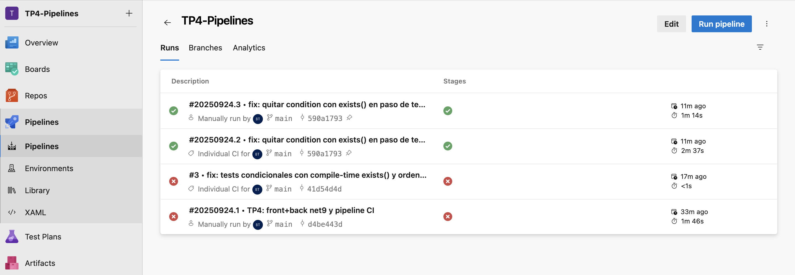
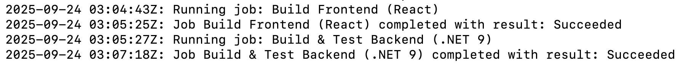

# decisiones.md — TP0 Azure DevOps Pipelines

**Org/Proyecto ADO:** `belutp / TP4-Pipelines`
**Repositorio:** mono-repo con `/front` (React + Vite) y `/back` (.NET 9 Web API)

## 1. Stack elegido y estructura del repo
**Stack**
- **Frontend:** React + Vite (Node 22.x en CI).
- **Backend:** .NET 9 Web API + tests con xUnit.
- **CI:** Azure Pipelines con agente Self-Hosted en macOS.

**Estructura**
```bash
/TP4-Pipelines
├─ front/               # app React (Vite)
│  └─ dist/             # output de build (generado)
├─ back/                # .NET 9 Web API
├─ back.tests/          # xUnit tests
├─ publish/             # publish local (solo para verificación)
├─ app.sln              # solución .NET
└─ azure-pipelines.yml  # pipeline YAML
```

**Motivación (mono-repo):** facilita CI coordinado, una sola fuente de verdad y artefactos versionados del front y back en el mismo run.

## 2. Preparación del entorno (Self-Hosted)
### 2.1 - Pool y agente
1. En **Project Settings → Agent pools**, creé pool `SelfHosted`.


2. **New agent** (macOS, x64) → descargué el paquete y lo descomprimí en `~/ado-agent/`.

3. Gatekeeper de macOS bloqueó binarios. Lo resolví con:
```bash
cd ~/ado-agent
sudo xattr -dr com.apple.quarantine .
chmod +x ./config.sh ./run.sh ./bin/Agent.Listener
```
4. Configuré el agente:
```bash
./config.sh
# URL: https://dev.azure.com/belutp
# Auth: PAT
# Pool: SelfHosted
# Agent name: Agent-Local
```
5. Lo levanté para trabajar:
```bash
./run.sh   # "Listening for Jobs"
```


### 2.2 - Acceso Git (problema y solución)
- Cargar a Azure Repos falló con PAT por 400/credenciales.
- Migré a SSH:
```bash
ssh-keygen -t rsa -b 4096 -C "belutp@outlook.com"
cat ~/.ssh/id_rsa.pub   # agregada en ADO: User settings → SSH public keys
git remote set-url origin ssh://git@ssh.dev.azure.com/v3/belutp/TP4-Pipelines/TP4-Pipelines
git push -u origin main
```

## 3. Diseño del pipeline (stages, jobs, artefactos)
### 3.1 - Objetivo
- **CI** al hacer push a `main`.
- Compilar **front** y **back**, correr tests del back y **publicar artefactos**.

### 3.2 - YAML final
```yaml
trigger:
  branches:
    include:
    - main

pool:
  name: SelfHosted

stages:
- stage: CI
  displayName: "Continuous Integration"
  jobs:

  # ---------- FRONT ----------
  - job: Build_Front
    displayName: "Build Frontend (React)"
    steps:
    - task: NodeTool@0
      displayName: "Use Node.js 22.x"
      inputs:
        versionSpec: '22.x'   # si preferís 20.19.0+, cambialo por '20.x'

    - script: |
        cd front
        npm ci
        npm run build
      displayName: "npm ci & build"

    - task: PublishPipelineArtifact@1
      displayName: "Publicar artefacto: front_dist"
      inputs:
        targetPath: 'front/dist'
        artifact: 'front_dist'

  # ---------- BACK ----------
  - job: Build_Back
    displayName: "Build & Test Backend (.NET 9)"
    steps:
    - task: UseDotNet@2
      displayName: "Use .NET SDK 9.x"
      inputs:
        packageType: 'sdk'
        version: '9.0.x'

    - script: |
        cd back
        dotnet restore
        dotnet build --configuration Release --no-restore
      displayName: "dotnet restore & build"

    - script: |
        cd back.tests
        dotnet test --configuration Release --logger trx
      displayName: "dotnet test"

    - script: |
        cd back
        dotnet publish --configuration Release --output $(Build.ArtifactStagingDirectory)/back_publish
      displayName: "dotnet publish"

    - task: PublishPipelineArtifact@1
      displayName: "Publicar artefacto: back_publish"
      inputs:
        targetPath: '$(Build.ArtifactStagingDirectory)/back_publish'
        artifact: 'back_publish'
```

**Notas de diseño**
- **Pool:** `SelfHosted` → garantiza entorno controlado (Node 22.x, .NET 9).
- **Jobs separados** (front/back) y `dependsOn` para orden claro.
- **Artefactos publicados:**
    - `front_dist` → empaquetado del React (`front/dist`).
    - `back_publish` → salida de `dotnet publish` (Release).
- Trigger: `main` (CI puro como pide la consigna).

## 4. Desarrollo y verificación local
**Front**
```bash
cd front
npm install
npm run build   # genera /front/dist
```

**Back**
```bash
dotnet new sln -n app
dotnet new webapi -f net9.0 -o back
dotnet new xunit  -f net9.0 -o back.tests
dotnet sln app.sln add back/back.csproj back.tests/back.tests.csproj
dotnet add back.tests/back.tests.csproj reference back/back.csproj

dotnet restore
dotnet build -c Release
dotnet test  -c Release
dotnet publish back -c Release -o ./publish
```

## 5. Ejecuciones del pipeline
### 5.1 - Primeras ejecuciones (fallidas)
En las primeras corridas ocurrieron fallas en el job Build_back, con el error:
```nginx
Unrecognized value: 'exists'
```
- **Causa:** usé `condition: and(succeeded(), exists('back.tests'))` en el YAML, pero `exists()` no está soportado en condiciones de runtime.
- **Solución:** reescribí el paso eliminando la condición y dejando los tests siempre activos.
- **Commit de fix:**
```bash
git add azure-pipelines.yml
git commit -m "fix: quitar condition exists() en paso de tests"
git push
```

### 5.2 - Ejecución exitosa
Una vez corregidos los problemas:
- El job **Build_Front** ejecutó `npm ci` y `npm run build` sin errores, publicando artefacto `front_dist`.
- El job **Build_Back** restauró, compiló, corrió los tests de `back.tests` (correctos) y publicó el artefacto `back_publish`.


Artefactos publicados:


## Problemas encontrados y cómo los resolví
- **Gatekeeper (macOS) bloqueó binarios del agente**
    - `xattr -dr com.apple.quarantine .` + `chmod +x` → volvió a ejecutar `./config.sh`.
- **Error YAML:** `Unrecognized value: 'exists'` en `condition`.
    - Azure no soporta `exists()` en runtime. Solución: quitar `condition` y/o usar `${{ if exists() }}` (compile-time).
    - Dejé tests del back siempre (porque `back.tests` existe) y el run pasó en verde.
- **Push al repo fallando (HTTP 400 / PAT)**
    - Cambié a **SSH** (clave agregada en ADO) y el push a `main` funcionó.
- **Vite avisó engines** (Node ≥20.19 o ≥22.12)
    - En CI uso `NodeTool@0` con 22.x para cumplir el requirement.